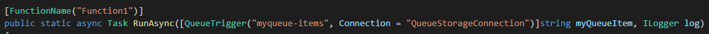

Follow the instructions  at [Manage a long-running operation](https://docs.microsoft.com/en-us/azure/bot-service/bot-builder-howto-long-operations-guidance?view=azure-bot-service-4.0) to configure the prerequisites and Azure Resources needed for the sample.

At a high level the steps include 

- Familiarity  with Prerequisites
- Create an Azure Storage account and Queue
- Create a bot resource
- Create the C# function ( provided in sample)
- Create the bot ( provided in sample)

Bot Project 
- Update the values in appsettings.json to the values obtained from Azure
- MicrosoftAppId
- MicrosoftAppPassword
- StorageQueueName
- QueueStorageConnection (storage connection string)

Function Project
- Update the values in local.settings.json to the values obtained from Azure
- QueueStorageConnection (storage connection string)
- DirectLineSecret
- Update the Queue name in the function with the name of the Queue created in Azure

Test with Bot locally with emulator & Ngrok
- Start Ngrok 
- Update Azure Bot configuration messaging endpoint with the ngrok url and append /api/messages
- Start bot 
- Connect Emulator to bot and supply MicrosoftAPpId and MicrosoftAppPassword
